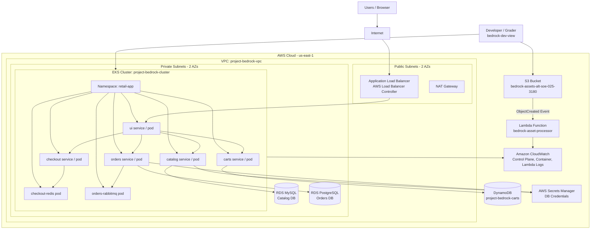

# Project Bedrock Architecture Diagram

Student ID: `ALT/SOE/025/3180`

AWS Region: `us-east-1`

## High-Level Architecture

## Architecture Notes

* The application is deployed to the `retail-app` namespace inside the EKS cluster.
* The `ui` service is exposed publicly through an AWS Application Load Balancer.
* The AWS Load Balancer Controller manages the ALB Ingress resource.
* Catalog data uses Amazon RDS MySQL in private subnets.
* Orders data uses Amazon RDS PostgreSQL in private subnets.
* Cart data uses Amazon DynamoDB.
* Redis and RabbitMQ run inside the EKS cluster as allowed by the project instruction.
* Database credentials are stored securely and are not hardcoded in committed Helm values.
* EKS control plane logs and container logs are shipped to CloudWatch.
* S3 uploads to `bedrock-assets-alt-soe-025-3180` trigger the `bedrock-asset-processor` Lambda function.
* Lambda logs the uploaded file name to CloudWatch using the required format: `Image received: [filename]`.
* `bedrock-dev-view` has read-only AWS and Kubernetes access, plus S3 upload permission for the assets bucket.
* `bedrock-cicd-deploy` is used by GitHub Actions to run Terraform CI/CD.
